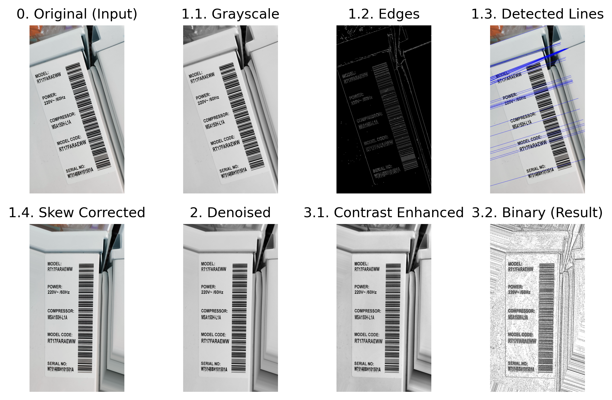

# 가전제품 라벨 OCR 인식 향상 이미지 전처리 파이프라인



본 프로젝트는 가전제품 라벨과 같이 텍스트가 포함된 이미지의 OCR(광학 문자 인식) 품질을 극대화하기 위한 이미지 전처리 파이프라인에 대한 예시를 보여줍니다. 기울기 보정, 노이즈 제거, 문자 대비 향상 등 OCR에 최적화된 전처리 과정을 단계별로 구현하고, 각 단계의 결과를 시각적으로 확인할 수 있습니다.

## 주요 특징
- **기울기 보정**: 허프 변환(Hough Transform) 기반 직선 검출로 이미지의 기울어짐을 자동으로 보정
- **노이즈 제거**: 가우시안 블러를 활용한 고주파 노이즈 억제
- **문자 대비 향상**: CLAHE(제한 대비 적응 히스토그램 평활화)와 적응형 임계처리로 문자 대비 극대화 및 이진화
- **단계별 결과 저장 및 시각화**: 각 처리 단계의 중간 결과를 outputs/ 폴더에 저장, 전체 파이프라인을 한눈에 볼 수 있는 시각화 이미지(pipeline_output.png) 자동 생성

## 파이프라인 구조
1. **Skew Correction**
   - 입력 이미지를 그레이스케일 변환 → 엣지 검출 → 직선 검출 및 시각화 → 평균 기울기 각도로 회전 보정
2. **Noise Suppression**
   - 가우시안 블러로 노이즈 억제
3. **Contrast Enhancement**
   - CLAHE로 대비 향상 → 적응형 임계처리로 이진화
4. **Visualization**
   - 각 단계별 결과를 Matplotlib으로 시각화 및 저장

## 결과 예시
outputs/ 폴더에는 다음과 같은 중간 결과 이미지가 생성됩니다:
- `1_1_grayscale.jpg`: 그레이스케일 변환
- `1_2_edges.jpg`: 엣지 검출
- `1_3_lines.jpg`: 검출된 직선 시각화
- `1_4_corrected.jpg`: 기울기 보정 결과
- `2_denoised.jpg`: 노이즈 억제 결과
- `3_1_contrast_enhanced.jpg`: 대비 향상 결과
- `3_2_binary.jpg`: 최종 이진화 결과

또한, 전체 파이프라인의 흐름을 한눈에 볼 수 있는 `pipeline_output.png`가 생성됩니다.

## 설치 및 실행 방법
1. **필수 패키지 설치**
   ```sh
   pip install opencv-python numpy matplotlib
   ```
2. **입력 이미지 준비**
   - 프로젝트 루트에 OCR 대상 이미지를 `ref-tilt.jpg`로 저장하거나, lab.ipynb 내 `input_image` 경로를 수정하세요.
3. **Jupyter Notebook 실행**
   - `lab.ipynb`를 실행하여 각 셀을 순차적으로 실행하면 outputs/ 폴더와 pipeline_output.png가 생성됩니다.

---

## 참고
- https://tesseract-ocr.github.io/tessdoc/ImproveQuality.html
